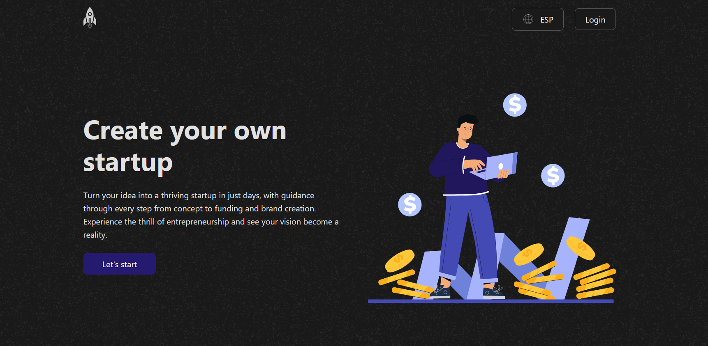

# Launch




Launch helps you turn your idea into a thriving startup in just days, providing guidance through every step from concept to funding and brand creation. Experience the thrill of entrepreneurship and see your vision become a reality.

## Technologies Used

*   React Native
*   Expo
*   TypeScript
*   Supabase
*   React Navigation
*   React Hook Form
*   Async Storage
*   React Native Picker

## Installation

To install and run the Launch project locally, follow these steps:

1.  Clone the repository:

    ```bash
    git clone <URL_DEL_REPOSITORIO>
    ```

2.  Navigate to the project directory:

    ```bash
    cd cproject
    ```

3.  Install dependencies:

    ```bash
    npm install
    # or
    yarn install
    # or, if you have issues with native dependencies
    npx expo install
    ```

## Usage

To start the development server:

```bash
npm start
# or
yarn start
```

## License

Released under the MIT License.
